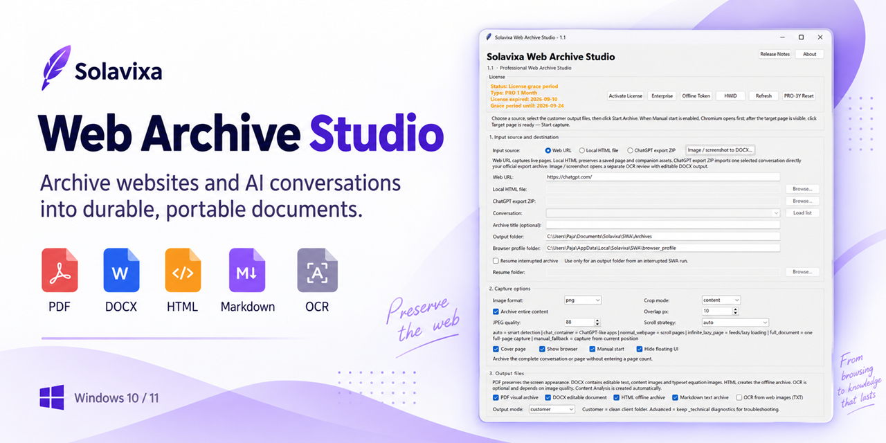
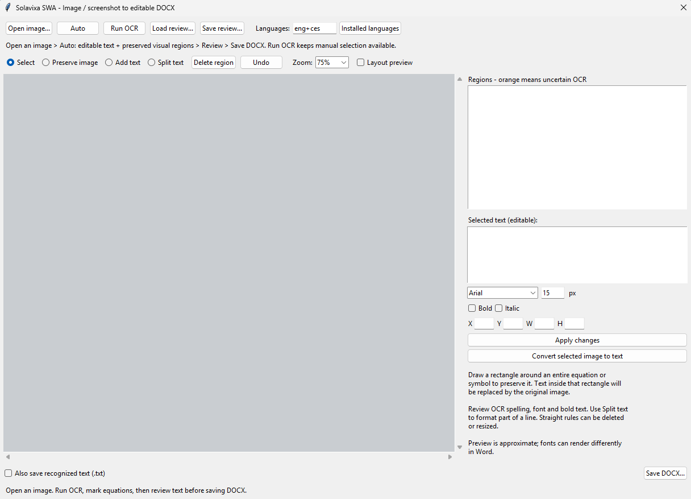

# Solavixa Web Archive Studio

**Archive websites and AI conversations into durable, portable documents.**

Solavixa Web Archive Studio is a Windows desktop application designed for high-quality archiving of web content and AI conversations.

## Features

- Archive web pages and AI conversations
- Export to PDF, DOCX, HTML and Markdown
- Preserve images, assets and attachments
- OCR image-to-DOCX workflow
- Preserve mathematical expressions, symbols and visual elements
- Process content locally on your Windows PC

## Download

The official Windows installer is available in the **Releases** section of this repository.

Current stable release: **Solavixa Web Archive Studio 1.1**

## Trial and Licensing

Web Archive Studio is proprietary commercial software.

The installer includes the Solavixa trial/licensing system. Commercial licenses are available from the official Solavixa website.

## Official Website

https://solavixa.com/products/web-archive-studio/

## User Guides

https://solavixa.com/user-guides/

## Security

Official Solavixa Windows installers are digitally signed.

Only download Solavixa software from the official Solavixa website, Microsoft Store, or official Solavixa distribution channels.

## Copyright

Copyright © Solavixa. All rights reserved.

This repository is used for official software distribution and product information.  
The application source code is not distributed as open source.
